# /IOTCONNECT WebRTC Demo on Ameba Pro 2

This guide walks users through setting up the WebRTC KVS master demo for the 
Realtek RTL8735B (Ameba Pro 2 Mini) that connects through **/IOTCONNECT** for 
device management, MQTT telemetry, and automatic AWS credential delivery.

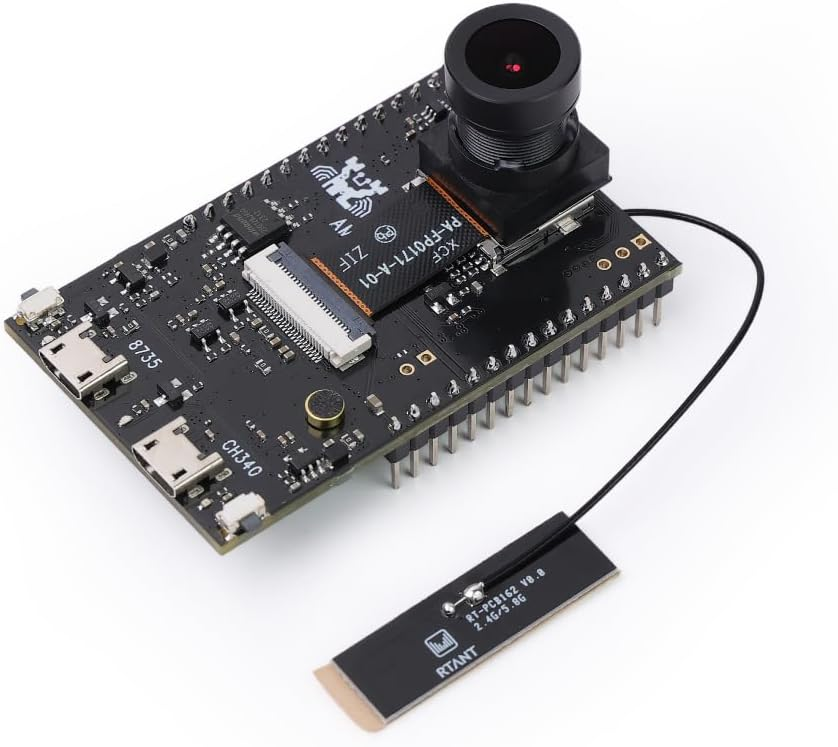

---

1. [Create an /IOTCONNECT account](#prerequisite-iotconnect-cloud-account)
2. [Onboard your device](#onboarding-steps) in the /IOTCONNECT portal and download the device config JSON and certificates zip
3. [Clone](#clone-this-repository-to-your-host-pc) the repo with submodules
4. [Run the /IOTCONNECT config script](#iotconnect-firmware-configuration) to apply all credentials automatically
5. [Install the toolchain](#toolchain-setup) and add it to `PATH`
6. [Build](#build) with `./build.sh`
7. [Flash](#flash) the resulting `flash_ntz.bin` to the board
8. [Set WiFi credentials](#set-wifi-credentials-first-time-only) over serial (first time only)

---

## Host PC Requirements

- Linux or macOS build host (Windows users: see the [MinGW/MSYS2 build instructions](project/realtek_amebapro2_webrtc_application/GCC-RELEASE/Readme.md) bundled with the SDK).
- CMake 3.22 or later.

---

## Prerequisite: /IOTCONNECT Cloud Account

If you do not yet have an /IOTCONNECT account, a free trial subscription with an AWS backend is available. The free subscription may be obtained directly from iotconnect.io or through the AWS Marketplace.

* Option #1 (Recommended) [/IOTCONNECT via AWS Marketplace](https://github.com/avnet-iotconnect/avnet-iotconnect.github.io/blob/main/documentation/iotconnect/subscription/iotconnect_aws_marketplace.md) - 60 day trial; AWS account creation required
* Option #2 [/IOTCONNECT via iotconnect.io](https://subscription.iotconnect.io/subscribe?cloud=aws) - 30 day trial; no credit card required

> [!NOTE]
> Be sure to check any SPAM folder for the temporary password after registering.

See the /IOTCONNECT [Subscription Information](https://github.com/avnet-iotconnect/avnet-iotconnect.github.io/blob/main/documentation/iotconnect/subscription/subscription.md) for more details on the trial.

---

## /IOTCONNECT Onboarding Steps

Follow these steps to onboard your device into /IOTCONNECT via the online user interface.

1. In a web browser, navigate to console.iotconnect.io and log into your account.

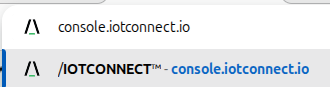

2. In the blue toolbar on the left edge of the page, hover over the "processor" icon and then in the resulting dropdown
   select "Device".


3. Now in the resulting Device page, click on the "Templates" tab of the blue toolbar at the bottom of the screen.

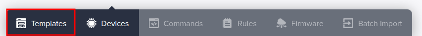

4. Right-click and then click "save link as" on [this link to the default device template](https://raw.githubusercontent.com/avnet-iotconnect/iotc-ameba-pro2-webrtc-kvs/refs/heads/main/docs/plitekvs-template.json)
   to download the raw template file. **Make sure to save it as a json file-type. Other file types will not be accepted by /IOTCONNECT.**

5. Back in the /IOTCONNECT browser tab, click on the "Create Template" button in the top-right of the screen.


6. Click on the "Import" button in the top-right of the resulting screen.


7. Select your downloaded copy of the plitekvs template from sub-step 4 and then click "save".

8. Click on the "Devices" tab of the blue toolbar at the bottom of the screen.

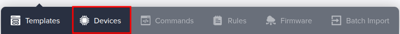

9. In the resulting page, click on the "Create Device" button in the top-right of the screen.


10. Customize the "Unique ID" and "Device Name" fields to your needs (both fields should be identical though).

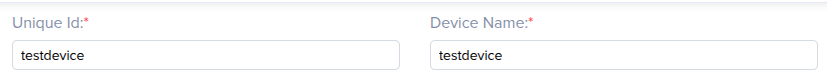

11. Select the most appropriate option for your device from the "Entity" dropdown (only for organization, does not
    affect connectivity).


12. Select "plitekvs" from the "Template" dropdown.

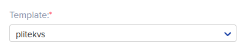

13. In the resulting fields, make the following selections:
    * Stream Type: **Module Based**
    * Stream Resource: **WebRTC**
    * Auto Start Video Stream?: **OFF** (default option)
    * Device Certificate: **Auto-generated** (default option) 

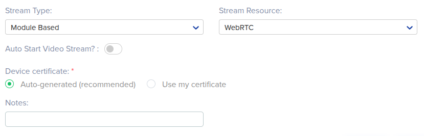

14. Click the "Save and View" button to go to the page for your new device.

15. Now on your device's page in /IOTCONNECT, click on the black/white/green paper-and-cog icon in the top-right of the
    device page (just above "Connection Info") to download your device's configuration file.


16. Now click on "Connection Info" and then click on the yellow certificate icon, and then click on "Download" to download your device's zipped certificate/key files.

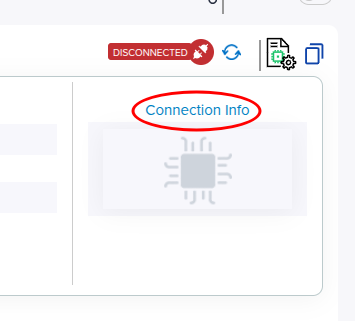

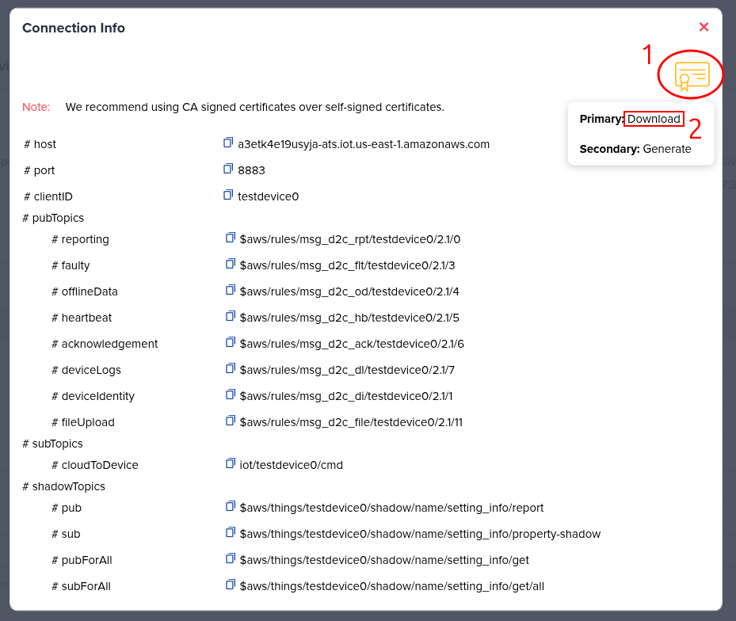

17. These downloaded files should remain as-is inside your local Downloads folder, as the /IOTCONNECT configuration script will look for them there in a later step.

---

## Clone This Repository to Your Host PC

```sh
git clone https://github.com/avnet-iotconnect/iotc-ameba-pro2-webrtc-kvs.git
cd iotc-ameba-pro2-webrtc-kvs
git submodule update --init --recursive
```

---

## /IOTCONNECT Firmware Configuration

A single script handles all device configuration — credentials and build options.
Run it from the repository root (where you should already be).

```sh
./iotc_config.sh
```

> [!TIP]
> **Windows users:** Open **Git Bash** (installed with [Git for Windows](https://git-scm.com/download/win)) and run the command above from inside it.
> PowerShell and Command Prompt will not work.

> [!NOTE]
> This script automatically searches your local Downloads folder for the most recently-downloaded `iotcDeviceConfig.json` file to determine
> the /IOTCONNECT config data, and then searches for the zipped certificate package that has the same device unique ID name as the one found
> in the `iotcDeviceConfig.json` file. If you have downloaded multiple `iotcDeviceConfig.json` files to your Downloads directory, they will be
> numbered by your file system and the script will select the file with the highest number to ensure it is the newest, correct file.

---

## Toolchain Setup

1. Download the Realtek cross-compiler for your host OS:
   [Ameba Toolchain V10.3.0](https://github.com/Ameba-AIoT/ameba-toolchain/releases/tag/V10.3.0-amebe-rtos-pro2)

2. Extract and add to `PATH`:

   **Linux / macOS:**
   ```sh
   cd ~/Downloads
   tar -xvf asdk-10.3.0-linux-newlib-build-*.tar.bz2
   ```

   Then add the toolchain to your `PATH`. Run the command for your OS:

   Linux:
   ```sh
   export PATH=~/Downloads/asdk-10.3.0/linux/newlib/bin:$PATH
   ```

   macOS:
   ```sh
   export PATH=~/Downloads/asdk-10.3.0/darwin/newlib/bin:$PATH
   ```

   To make this permanent, add the `export PATH=...` line to your `~/.bashrc` or `~/.zshrc`.

   **Windows:** Extract the downloaded archive using 7-Zip or Windows Explorer, then add the
   `asdk-10.3.0\mingw32\newlib\bin` folder to your system `PATH` via
   **System Properties → Environment Variables**.

> [!TIP]
> **Windows builds:** Use the MinGW/MSYS2 environment bundled with the Realtek SDK for the
> actual build step. See the [MinGW/MSYS2 build instructions](project/realtek_amebapro2_webrtc_application/GCC-RELEASE/Readme.md)
> for details.

---

## Build

**Linux / macOS:** With the toolchain on `PATH`, navigate back to the repository root and run the build script:

```sh
cd <PATH_TO_REPO>
```

```sh
./build.sh
```

The script configures CMake on the first run and builds the firmware. The output binary is `project/realtek_amebapro2_webrtc_application/GCC-RELEASE/build/flash_ntz.bin`

**Windows:** The build must be run from the MinGW/MSYS2 shell that is bundled with the Realtek SDK — do **not** use PowerShell or Command Prompt. See the [Windows build instructions](project/realtek_amebapro2_webrtc_application/GCC-RELEASE/Readme.md) for step-by-step guidance on opening the correct shell and running the build.

---

## Flash

The flash tool is bundled in the repository at `libraries/ambpro2_sdk/tools/Pro2_PG_tool _v1.4.3/`

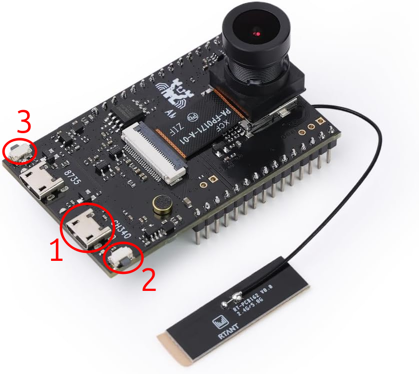

**(1) Micro-USB port — (2) Reset button — (3) Program button**

### Connect the board to your PC

1. Connect a micro-USB cable from your PC to the **micro-USB port (1)** on the board.

> [!NOTE]
> Use a micro-USB cable that supports **data transfer**. Many micro-USB cables are charge-only and contain no data wires — the board will not be detected by your PC if you use one of these.

### Enter program mode on the board

2. Press and hold the **Reset button (2)**.
3. While keeping Reset held, press and hold the **Program button (3)**.
4. Release **Reset (2)**.
5. Release **Program (3)**.

### Flash the binary

**Linux:**
```sh
cd "libraries/ambpro2_sdk/tools/Pro2_PG_tool _v1.4.3"
# Requires dialout group membership — if you get a port-open error:
#   sudo usermod -aG dialout $USER  (then log out and back in)
sudo ./uartfwburn.linux \
    -p /dev/ttyUSB0 \
    -f ../../../../project/realtek_amebapro2_webrtc_application/GCC-RELEASE/build/flash_ntz.bin \
    -b 2000000 -U
```
Replace `/dev/ttyUSB0` with your actual port (`ls /dev/ttyUSB*`).

**Windows (PowerShell):**
```powershell
cd "libraries\ambpro2_sdk\tools\Pro2_PG_tool _v1.4.3"
.\uartfwburn.exe -p COMxx -f "..\..\..\..\project\realtek_amebapro2_webrtc_application\GCC-RELEASE\build\flash_ntz.bin" -b 2000000 -U
```
Replace `COMxx` with the COM port shown in Device Manager.

---

## Run

### Connect serial terminal

Open a serial terminal at **115200 8N1** on the board's USB serial port:

**Linux / macOS:**
```sh
minicom -D /dev/ttyUSB0 -b 115200
```

**Windows:** Use [PuTTY](https://www.putty.org/). Select **Serial**, set the speed to `115200`, and set the serial line to the COM port shown in Device Manager (e.g. `COM3`). Leave all other settings at their defaults (8 data bits, no parity, 1 stop bit).

Press **Reset** to reboot the board and see log output.

### Set WiFi Credentials (first time only)

While the board is at the console prompt, send:
```
ATW0=<your-ssid>
ATW1=<your-password>
ATWC
```
Credentials are stored in flash and used on every subsequent boot.

---
## Control and View Stream via /IOTCONNECT

When your device was onboarded into /IOTCONNECT, the "auto-start stream" option was disabled. This means
that the device will not begin streaming until it receives a "start stream" command from /IOTCONNECT.

To send the "start stream" command, in the online /IOTCONNECT UI first go to your device's page.

Then click on the "Video Streaming" tab on the vertical toolbar. 

Click the "Start" button in the top-right to send the "start stream" command to the device and within a few moments
the stream will be viewable in that same page.

To stop the stream, click the same button (which should now say "Stop").

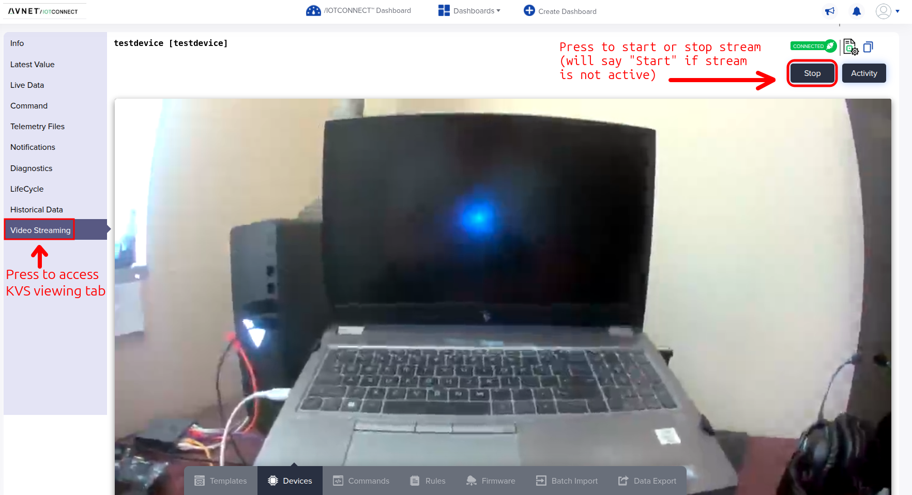

---

## License

This project is licensed under the Apache-2.0 License.
